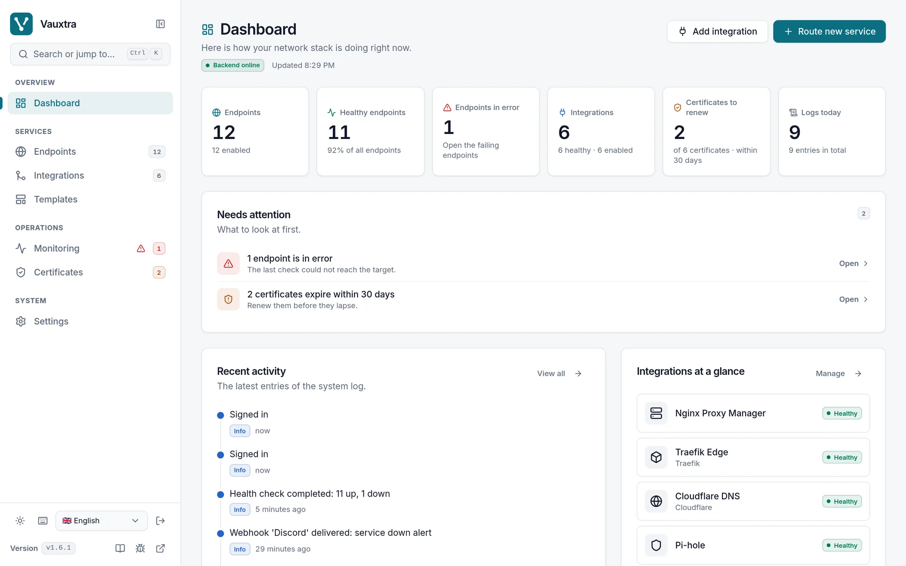
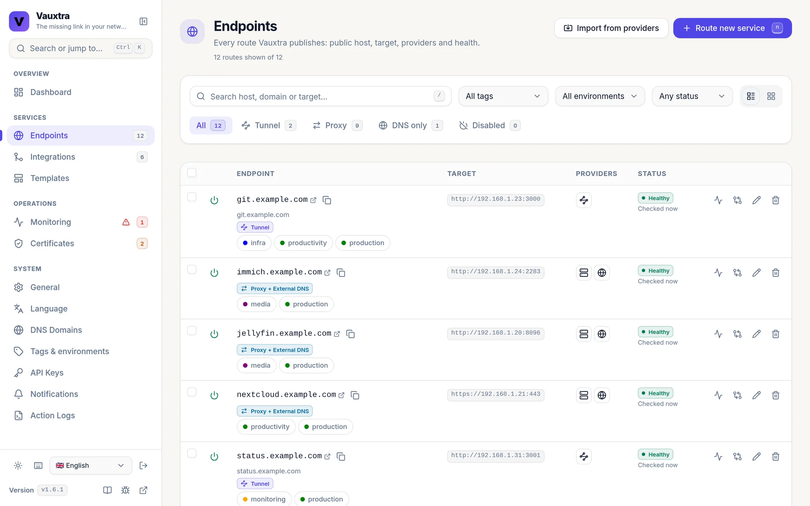
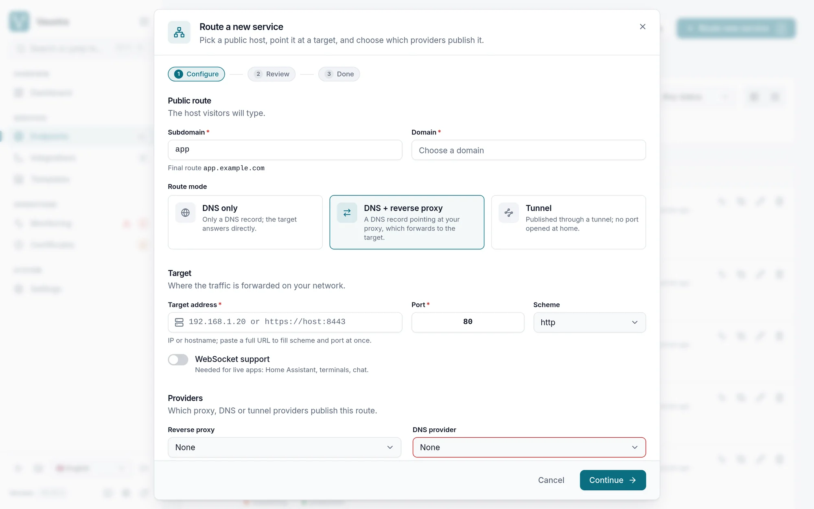
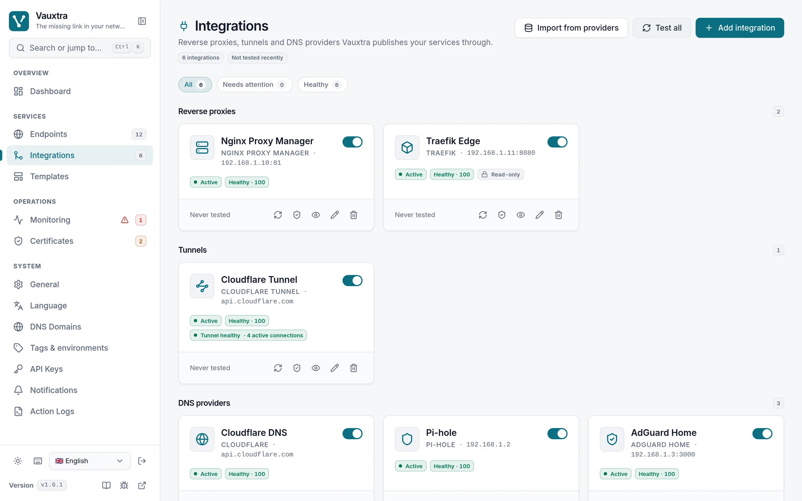
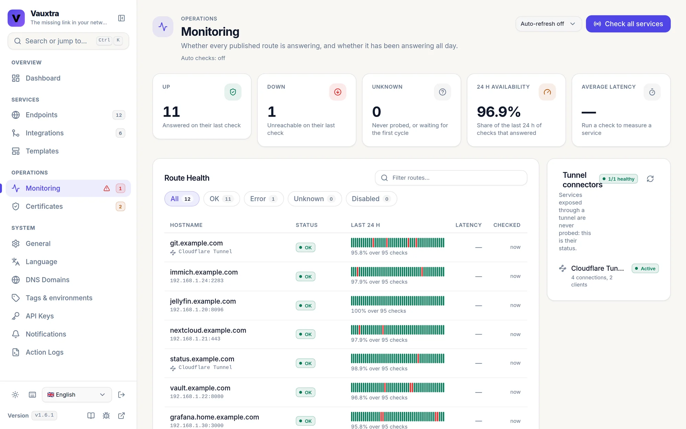
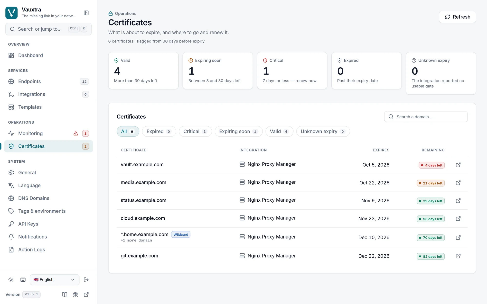
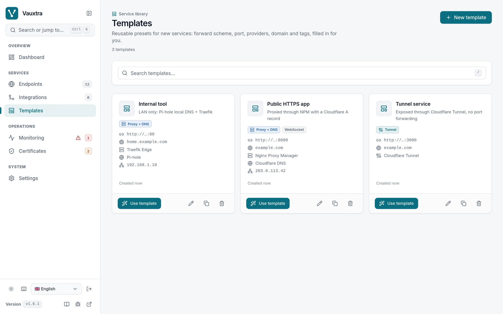

<div align="center">

<a href="https://github.com/ptitzgeg-on-git/vauxtra">
  <picture>
    <source media="(prefers-color-scheme: dark)" srcset="docs/assets/banner-dark.png">
    
  </picture>
</a>

**Self-hosted DNS and reverse proxy management for homelabs.**<br>
Describe a service once. Vauxtra publishes it to Nginx Proxy Manager, Traefik, Zoraxy,
Cloudflare, Pi-hole, AdGuard Home and the other tools you already run, then keeps them in sync.

[](https://github.com/ptitzgeg-on-git/vauxtra/actions/workflows/tests.yml)
[](https://github.com/ptitzgeg-on-git/vauxtra/releases)
[](https://github.com/ptitzgeg-on-git/vauxtra/pkgs/container/vauxtra)
[](LICENSE)

[**Quick start**](#quick-start) · [**Features**](#features) · [**Security**](#security) · [**Providers**](#provider-setup) · [**Docs**](#documentation) · [**MCP**](#mcp-server)

<br>

<picture>
  <source media="(prefers-color-scheme: dark)" srcset="docs/assets/screenshots/dashboard-dark.webp">
  
</picture>

</div>

---

## Why

Publishing a self-hosted app usually means a DNS record in Pi-hole or Cloudflare, a proxy
host in Nginx Proxy Manager or Traefik, sometimes a Cloudflare Tunnel route, and keeping the
three in sync afterwards. In Vauxtra a service is one record: a hostname, a target and the
providers that publish it. Vauxtra pushes it, checks it and tells you when a provider no
longer matches.

Vauxtra drives the tools you already run. It does not run a DNS server or a proxy itself,
and it does not replace them.

## Features

- **Providers.** Reverse proxies: Nginx Proxy Manager, Zoraxy, Traefik (read-only) and
  Cloudflare Tunnel. DNS: Cloudflare, deSEC, Pi-hole, AdGuard Home, Technitium and PowerDNS.
  [What is supported and what is not](docs/PROVIDERS.md).
- **Three ways to publish.** DNS only, DNS plus a reverse proxy, or a Cloudflare Tunnel, with
  guidance on what each provider can do.
- **Preflight and dry-run.** See what a push will change before it changes anything.
- **Drift detection.** Vauxtra compares each provider with what it expects and can
  reconcile on a schedule.
- **Monitoring.** Health checks per service, certificate expiry for NPM and Zoraxy, and
  alerts through [Apprise](https://github.com/caronc/apprise) (Discord, Telegram, ntfy and
  others), retried with backoff.
- **Docker discovery.** Lists running containers and reads their Traefik labels to suggest
  a service.
- **Templates** for the kinds of service you create often.
- **Automation.** API keys scoped `read`, `write` or `admin`, an MCP server and a
  Prometheus `/metrics` endpoint.
- **Interface** in English, French, German, Spanish, Portuguese, Dutch, Japanese and Chinese.

## Screenshots

<table>
  <tr>
    <td width="50%" valign="top">
      <b>Services</b>: every published service with its address, target, providers and health.<br><br>
<picture>
  <source media="(prefers-color-scheme: dark)" srcset="docs/assets/screenshots/services-dark.webp">
  
</picture>
    </td>
    <td width="50%" valign="top">
      <b>Add a service</b>: DNS only, DNS and reverse proxy, or tunnel, in one form.<br><br>
<picture>
  <source media="(prefers-color-scheme: dark)" srcset="docs/assets/screenshots/wizard-dark.webp">
  
</picture>
    </td>
  </tr>
  <tr>
    <td width="50%" valign="top">
      <b>Integrations</b>: proxies, tunnels and DNS providers with their health.<br><br>
<picture>
  <source media="(prefers-color-scheme: dark)" srcset="docs/assets/screenshots/providers-dark.webp">
  
</picture>
    </td>
    <td width="50%" valign="top">
      <b>Monitoring</b>: 24-hour availability per service and tunnel connectors.<br><br>
<picture>
  <source media="(prefers-color-scheme: dark)" srcset="docs/assets/screenshots/monitoring-dark.webp">
  
</picture>
    </td>
  </tr>
  <tr>
    <td width="50%" valign="top">
      <b>Certificates</b>: expiry across NPM and Zoraxy, flagged 30 days ahead.<br><br>
<picture>
  <source media="(prefers-color-scheme: dark)" srcset="docs/assets/screenshots/certificates-dark.webp">
  
</picture>
    </td>
    <td width="50%" valign="top">
      <b>Templates</b>: presets that fill the service form in one click.<br><br>
<picture>
  <source media="(prefers-color-scheme: dark)" srcset="docs/assets/screenshots/templates-dark.webp">
  
</picture>
    </td>
  </tr>
</table>

Screenshots follow your GitHub theme.

## Quick start

With Docker Compose:

```yaml
# docker-compose.yml
services:
  vauxtra:
    image: ghcr.io/ptitzgeg-on-git/vauxtra:latest
    ports:
      # Loopback by default; VAUXTRA_BIND=0.0.0.0 publishes on every interface.
      - "${VAUXTRA_BIND:-127.0.0.1}:8888:8888"
    volumes:
      - ./data:/app/data
      - /var/run/docker.sock:/var/run/docker.sock:ro
    environment:
      - TZ=${TZ:-UTC}
    restart: unless-stopped
```

```bash
docker compose up -d
```

Or with `docker run`:

```bash
docker run -d \
  --name vauxtra \
  -p 127.0.0.1:8888:8888 \
  -v vauxtra_data:/app/data \
  -v /var/run/docker.sock:/var/run/docker.sock:ro \
  ghcr.io/ptitzgeg-on-git/vauxtra:latest
```

Open http://localhost:8888 and follow the setup wizard. `data/` holds the SQLite database
and, unless you set `SECRET_KEY`, the generated key that encrypts provider credentials.

Two things to know before you open the port to your network:

- **The port is published on the loopback on purpose.** The panel holds provider
  credentials and has no password of its own until you finish the wizard. Once you have
  set one, `-p 8888:8888` makes it reachable from the LAN, preferably behind a reverse proxy.
- **The Docker socket is optional and is root on the host.** Vauxtra only uses it to list
  containers, but `:ro` applies to the socket file, not to the Docker API: whoever controls
  Vauxtra can start a privileged container. Drop the `docker.sock` line if you do not use
  discovery (the Docker screens then say the daemon is unavailable), or point Vauxtra at a
  read-only socket proxy.

To build from source instead: clone the repository, run `cp .env.example .env` (the compose
file reads `.env` and will not start without it), then `docker compose up --build -d`.

## Configuration

All settings are environment variables. Copy `.env.example` to `.env` to start. The table
lists the main ones; [`.env.example`](.env.example) is the full list, with a comment on each.

| Variable | Default | Description |
|---|---|---|
| `SECRET_KEY` | generated | Signs the session cookie and encrypts provider credentials. Generated into `data/.secret_key` when empty. **Do not change it after adding providers**: the stored credentials become unreadable. |
| `APP_PASSWORD` | *(none)* | Admin password, as a PBKDF2 hash. Leave empty to set it in the setup wizard. |
| `ALLOW_PLAINTEXT_APP_PASSWORD` | `false` | Accept a plaintext `APP_PASSWORD`. Leave off outside a lab. |
| `TZ` | `UTC` | Timezone for the scheduler and log timestamps. |
| `HTTPS_ONLY` | `false` | Set to `true` whenever the panel is reached over `https://`, including behind a reverse proxy that terminates TLS. Marks the cookie `Secure` and sends HSTS. |
| `FORWARDED_ALLOW_IPS` | *(empty)* | Address of the reverse proxy in front of Vauxtra. Without it, every visitor shares one rate-limit counter, so five failed sign-ins from anywhere lock you out. Do not set it without a proxy in front. |
| `CORS_ORIGINS` | *(empty)* | Cross-origin callers allowed to use the API. Leave empty: the interface is served by the same application. Every origin listed may send the session cookie. |
| `DEBUG` | `false` | Serves `/api/docs` and `/openapi.json`, allows the Vite dev server and logs verbosely. |
| `DOCKER_HOST` | `unix:///var/run/docker.sock` | Seeds the first Docker endpoint on an empty database, nothing more. Change endpoints later in **Settings > Data**. |
| `VAUXTRA_BIND` | `127.0.0.1` | Host interface the compose file publishes port 8888 on. Read by Docker Compose, not by Vauxtra. |
| `VAUXTRA_REWRITE_LOCALHOST` | `true` | Rewrites `localhost` in provider URLs to a host alias when running in Docker. |
| `VAUXTRA_LOCALHOST_ALIAS` | `host.docker.internal` | The alias used by that rewrite. |
| `VAUXTRA_PROVIDER_PLUGINS` | *(empty)* | Extra provider types, as importable Python modules. Their code runs with Vauxtra's privileges. See [PROVIDERS](docs/PROVIDERS.md#adding-a-provider-without-forking). |
| `VAUXTRA_URL` | `http://localhost:8888` | Base URL of this instance, for the MCP server. |
| `VAUXTRA_API_KEY` | *(none)* | API key for the MCP server. Create one in **Settings > API Keys**. |

**Forgot the password?** If it comes from `.env`, edit the file. If you set it in the wizard
and you are still signed in, change it in **Settings > Security**. If you are locked out,
clear both rows and restart:

```bash
sqlite3 data/vauxtra.db "DELETE FROM settings WHERE key IN ('app_password_hash','auth_mode');"
```

Deleting only the hash is not enough on purpose. `auth_mode` is what tells an instance that
was deliberately left without a password apart from one whose hash went missing, and
Vauxtra refuses every request in the second case rather than opening up.

## Security

Vauxtra holds working credentials for your DNS and proxies, so it is built to be run on
your LAN or behind your VPN, not on the internet.

- Provider passwords and tokens are encrypted at rest. API keys are stored as hashes and
  scoped `read`, `write` or `admin`; a `write` key cannot read a stored secret or send it to
  another host.
- Sign-in is rate-limited, the session cookie is `HttpOnly` and `SameSite=Strict`, and the
  interface ships a strict Content-Security-Policy.
- Each provider's least-privilege credential, what each API scope can reach and the known
  limits are in the **[threat model](docs/THREAT_MODEL.md)**.
- Every image is signed with cosign and carries a SLSA provenance attestation. To check
  one (cosign 3.0 or later):

  ```bash
  cosign verify ghcr.io/ptitzgeg-on-git/vauxtra:1.7.0 \
    --certificate-identity 'https://github.com/ptitzgeg-on-git/vauxtra/.github/workflows/docker-publish.yml@refs/tags/v1.7.0' \
    --certificate-oidc-issuer https://token.actions.githubusercontent.com
  ```

To report a vulnerability, see [SECURITY.md](SECURITY.md).

## Provider setup

The setup wizard walks you through each provider. In short, and with the narrowest
credential each one accepts:

**Nginx Proxy Manager.** In NPM, create a dedicated user with *Proxy Hosts: Manage* and
*Certificates: View*. In Vauxtra, add an `npm` provider with `http://your-npm:81` and that
user's email and password.

**Traefik.** Read-only: Traefik configures itself from labels and files. Expose its API
(for example `http://traefik:8080`), add a `traefik` provider, then use **Import from
providers** on the Services or Integrations page to bring in existing routes (also in
**Settings > Data > Synchronization & Import**).

**Zoraxy.** Zoraxy has a single admin account and no API keys, so Vauxtra signs in with the
same credentials as the browser. Keep the management port on your LAN or VPN. Add a
`zoraxy` provider with `http://zoraxy:8000` (leave the credentials empty for an instance
started with `-noauth`), then **Import from providers**. Vauxtra manages host rules with one upstream
each; virtual directories, stream proxies and extra upstreams are left alone.

**Cloudflare DNS.** Create an API token with *Zone > DNS > Edit*, limited to your zones, and
add a `cloudflare` provider with it.

**Cloudflare Tunnel.** Create a tunnel in the Cloudflare dashboard and note its ID. Create a
token with *Account > Cloudflare Tunnel > Edit* and *Zone > DNS > Edit*. Add a
`cloudflare_tunnel` provider with your account ID, the token and the tunnel ID, then pick
**Tunnel** as the exposure mode when you create a service.

**Pi-hole and AdGuard Home.** Add the provider with its base URL (for Pi-hole,
`http://pihole`, not `/admin`) and its credentials: the API token or an app password for
Pi-hole, the admin login for AdGuard Home.

**PowerDNS Authoritative.** Enable the API in `pdns.conf` (`api=yes`, `api-key=...`,
`webserver=yes`, and a `webserver-allow-from` that includes Vauxtra). Add a `powerdns`
provider with `http://your-pdns:8081`, server ID `localhost` and the key. Records go into
zones PowerDNS already hosts; Vauxtra picks the longest zone that contains the name.

**deSEC.** Create a token in *Token management* without "Can manage tokens" and add a
`desec` provider with it. Leave the URL empty unless you run your own deSEC, and the domain
empty to let Vauxtra find the matching one.

## MCP server

Vauxtra ships an [MCP](https://modelcontextprotocol.io/) server that exposes its operations
as tools: services, templates, preflight and push, drift and reconcile, providers, Docker
discovery and monitoring. The [full list](vauxtra_mcp/README.md#available-tools) is in the
MCP server's README.

It runs next to your MCP client, not inside the image:

1. Create an API key in **Settings > API Keys**, with the lowest scope the client needs.
2. On the machine that runs the client, clone this repository and
   `pip install -r vauxtra_mcp/requirements.txt`.
3. Add it to your client configuration:

```json
{
  "mcpServers": {
    "vauxtra": {
      "command": "python",
      "args": ["-m", "vauxtra_mcp.server"],
      "cwd": "/path/to/vauxtra",
      "env": {
        "VAUXTRA_URL": "http://localhost:8888",
        "VAUXTRA_API_KEY": "vx_your_key_here"
      }
    }
  }
}
```

See [vauxtra_mcp/README.md](vauxtra_mcp/README.md) for the HTTP transport and the options.

## API

Every endpoint accepts `Authorization: Bearer <api_key>` as well as the session cookie. With
`DEBUG=true`, the interactive documentation is served at `http://localhost:8888/api/docs`.
The routes and the scope each one needs are listed in [HOWTO](docs/HOWTO.md).

## Documentation

- [HOWTO](docs/HOWTO.md): day-to-day use and the API
- [DEPLOYMENT](docs/DEPLOYMENT.md): production checklist and recipes
- [TROUBLESHOOTING](docs/TROUBLESHOOTING.md): known failures and what they mean
- [PROVIDERS](docs/PROVIDERS.md): what is supported, what was evaluated, writing your own
- [THREAT_MODEL](docs/THREAT_MODEL.md): what is stored, what each credential allows, verifying the image
- [lab/](lab/README.md): NPM, Pi-hole, AdGuard Home, Zoraxy, Technitium and PowerDNS in
  throwaway containers on the loopback, for the integration tests or to try Vauxtra without
  touching your network
- [SECURITY](SECURITY.md): reporting a vulnerability

## Upgrading

`latest` follows `main`, and `main` only receives releases:

```bash
docker compose pull
docker compose up -d
```

The database migrates itself at startup. Migrations only move forward, so back up `data/`
before upgrading if you may want to go back. To stay on one release line, pin a tag such as
`:1.7` ([pinning a version](docs/DEPLOYMENT.md#pinning-a-version)).

## Development

Requires Python 3.13+ for the backend and Node.js 22, 24 or 26+ for the frontend
([exact ranges](CONTRIBUTING.md#local-development-setup)).

```bash
# Backend
python -m venv .venv
source .venv/bin/activate
pip install -r requirements.txt
uvicorn app.main:app --reload --port 8888

# Frontend, in another terminal
cd frontend
npm install
npm run dev        # http://localhost:5173, proxies /api to :8888
```

`npm run build` writes the production build to `frontend/dist/`, and `npm run lint` runs
ESLint. The Dockerfile is a multi-stage build: Node 26 for the frontend, Python 3.14-slim for
the final image.

## Contributing

See [CONTRIBUTING.md](CONTRIBUTING.md) for the branch model, the commit convention and how to
add a provider or an MCP tool.

To add a translation:

1. Copy [`frontend/src/locales/en.json`](frontend/src/locales/en.json) to the
   [ISO 639-1 code](https://en.wikipedia.org/wiki/List_of_ISO_639-1_codes) of the language.
2. In [`frontend/src/i18n/index.tsx`](frontend/src/i18n/index.tsx), add the code to the `Lang`
   union, to `SUPPORTED_LANGUAGES` and to `LOCALE_TAGS` (the BCP-47 tag used for dates and
   numbers).
3. Run `npm run i18n:check` in `frontend/`. It lists missing keys and the plural forms
   (`_one`, `_other`, `_few`, `_many`) the language needs.
4. Open a pull request. No backend change is needed.

## How it's built

Vauxtra is written by one person, with heavy help from AI coding assistants (Claude Code).
Every change goes through the same gates whoever wrote it: about 2,000 backend tests, an
integration lab against real provider containers, lint, dependency and image scans, and a
reviewed pull request before it reaches `main`. If something looks wrong, open an issue, or
a [private advisory](SECURITY.md) for anything security-related.

## License

MIT. See [LICENSE](LICENSE).
